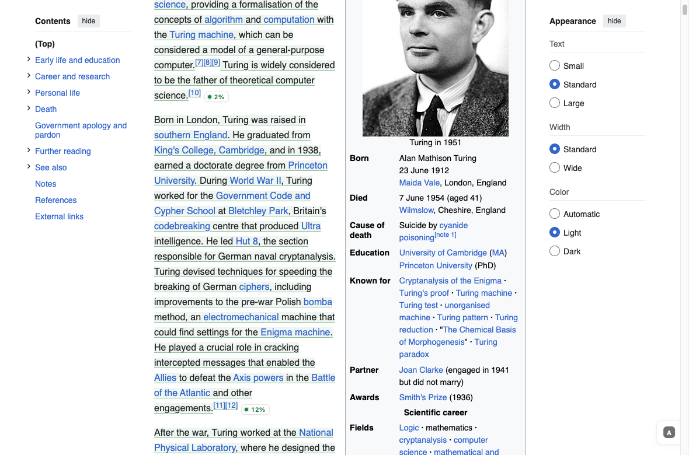
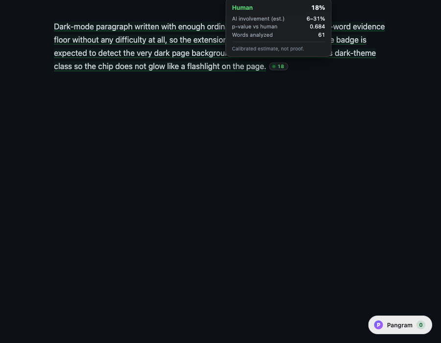
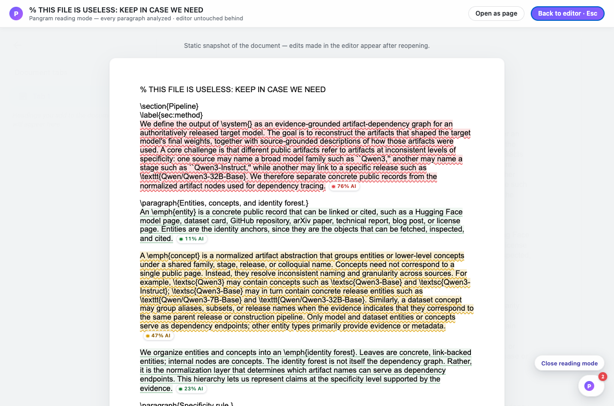
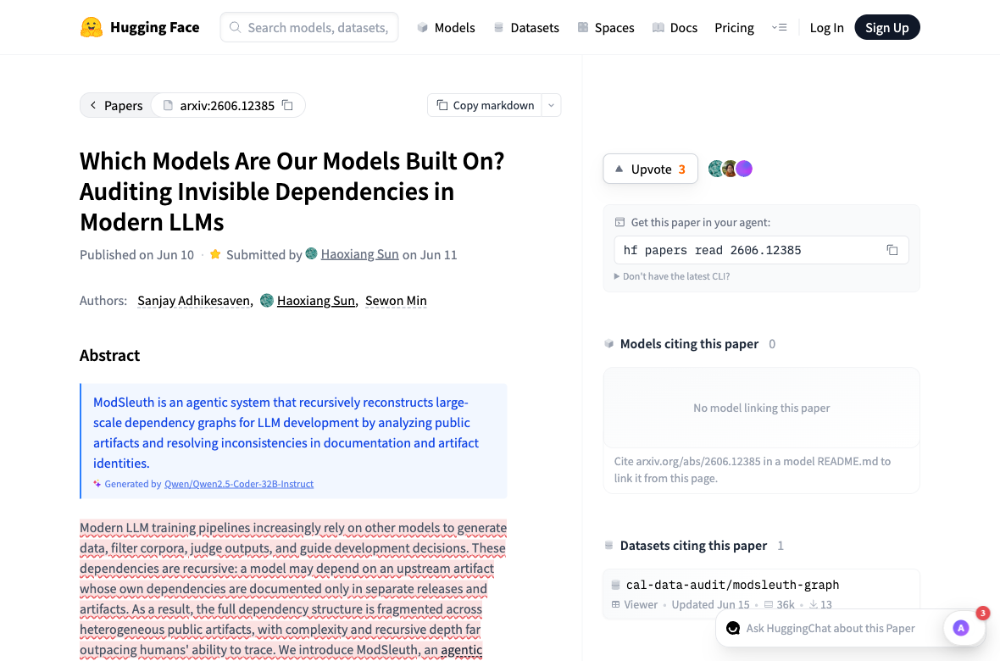
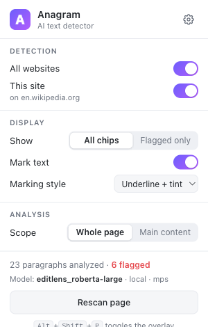
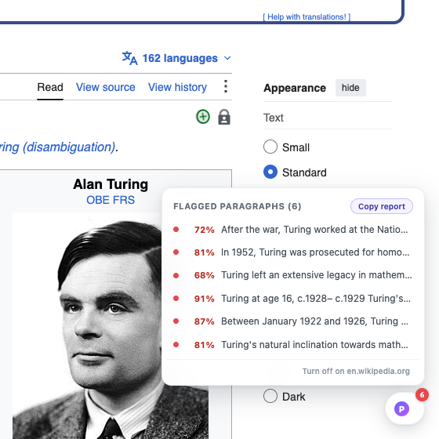

# Anagram for Chrome

**See what's AI-written, right on the page.** Anagram is a Chrome extension that
labels the text you read with a small per-paragraph chip — think Immersive
Translate, but instead of translating, it answers *"how much of this did an AI
write?"* — inline, live, on every site.

> **Scoring:** verdicts come from **EditLens** (`pangram/editlens_roberta-large`,
> Thai, Emi, Masrour & Iyyer, ICLR 2026), a 355M-parameter model that rates the
> *extent of AI editing* in a paragraph on four levels — human / lightly edited /
> heavily edited / AI-generated. It runs **on your machine** in a small local
> daemon (`anagramd/`, Apple-silicon GPU via MPS, ~30 ms for a short
> paragraph). There is no other scorer: without the daemon, paragraphs show as
> *Unavailable* and are retried automatically once it answers.

| Article pages | Dark mode + detail card |
| --- | --- |
|  |  |

| Google Docs — in-tab reading mode | Paper / abstract pages |
| --- | --- |
|  |  |

| Toolbar popup | Triage panel |
| --- | --- |
|  |  |

## Install (one line, one folder)

```bash
curl -fsSL https://github.com/CoderBak/anagram/releases/latest/download/install.sh | sh
```

That puts **everything** — a private Python, the daemon and its packages, the EditLens
checkpoint, the built extension — under `~/.anagram/` and touches nothing else: no
sudo, no Homebrew, no system Python, no shell-profile edits, no launch agent. Then:

```bash
~/.anagram/bin/anagram start       # the scoring daemon, 127.0.0.1:8765, stays until you stop it
```

and load the extension: `chrome://extensions` → Developer mode → **Load unpacked** →
`~/.anagram/extension`. `anagram status | stop | logs | selftest` do what they say;
`anagram doctor` checks the folder, the private Python and its packages, both model
files against the checksums the installer pinned, the free space and the port, and
prints one line per check with the command that fixes what is wrong (it only reads —
nothing is written, moved or removed); `anagram update` re-runs the installer and
restarts the daemon if one was running, so the code in memory is the code on disk;
`anagram uninstall` deletes the folder, which is the only thing the
installer ever created. The checkpoint is gated on Hugging Face (CC BY-NC-SA): the
installer asks for a read token unless `ANAGRAM_HF_TOKEN` is set; `ANAGRAM_HOME`
relocates the folder; `ANAGRAM_SKIP_MODEL=1` defers the 1.4 GB download to
`anagram model`. Footprint about 2 GB, install time a few minutes, mostly the download.

## Quick start from source

```bash
# 1. the extension
npm install
npm run build                      # Chrome → output/chrome-mv3/   (load unpacked, see below)

# 2. the model (gated on Hugging Face: accept the CC BY-NC-SA terms once, then)
hf download pangram/editlens_roberta-large --local-dir ../models/editlens_roberta-large

# 3. the scoring daemon (own venv from the lockfile; torch + transformers + fastapi + fasttext)
cd anagramd && uv sync --frozen && cd ..     # → anagramd/.venv
npm run serve                      # http://127.0.0.1:8765 — GET /health, POST /score
```

`npm run release` builds what the installer consumes (`dist/anagram.tar.gz` + checksum,
`dist/install.sh`, the store zip); pushing a `v*` tag publishes them as a GitHub Release.

The extension probes the daemon's `/health` and picks it up within seconds of it
starting; the popup names the model that is scoring, says *Daemon not running*
with a Retry, or — when something on that port answers with another contract
version — *Daemon version mismatch*. Options → *Scoring daemon* holds the URL,
which is restricted to loopback addresses. `sh anagramd/run.sh --selftest` scores
four sample paragraphs (one of them Chinese, which must come back unsupported),
prints PASS/FAIL per sample and exits non-zero if any of them is wrong.

## What you get

- **A chip after every analyzed paragraph** — `38%`, the model's estimate of how
  far the text sits between untouched human writing and fully AI-generated
  prose, with a color-coded verdict (green = Human, yellow = Lightly edited,
  orange = Heavily edited, red = AI-generated, gray = Unavailable). What the
  number means is spelled out in the hover card and on the first-run page, not
  repeated on every line. Chips scale with the surrounding text, sit on its baseline,
  reflow with the page (RTL included — the label itself never bidi-flips), and
  appear in a subtle **"analyzing…" state** the moment a paragraph is actually
  sent for scoring, morphing in place when the verdict lands. Hover — or tap, on
  touch — for the full readout: the verdict, a **four-bucket probability bar**
  with a row per bucket, words analyzed, how a long paragraph was read
  (**"Scored in 3 windows"** with each window's own number), and a
  **Copy text** action — always with an *"estimate, not proof"* caveat.
- **Verdict marks across what was read** (toggleable) — underline + tint,
  underline only, or tint only (options), with a dark-tuned palette on dark
  pages. A paragraph longer than the model reads in one pass is scored in
  consecutive windows and marked **window by window, each in its own colour**, so
  a text that turns from human to AI halfway shows where; the chip carries the
  one aggregate. Marks are screen-only: they never print.
- **A floating ball** like Immersive Translate's: drag it anywhere — it **snaps
  to the nearest edge**, remembers its spot per site, and **tucks itself
  half-away when idle** (hover brings it back). It hides in fullscreen video and
  rides the browser **top layer**, so cookie walls and modals never bury it.
  Click to show/hide everything instantly (no re-analysis) or press
  <kbd>Alt</kbd>+<kbd>Shift</kbd>+<kbd>P</kbd>. **Click the counter** to open the
  triage panel: every flagged paragraph (heavily edited or AI-generated) in
  order with **verdict filters** — click one to jump there and pulse its chip,
  **Copy report** for a markdown summary with each paragraph's bucket split and
  the model that produced it, or **turn Anagram off for the site** right from the
  panel. The toolbar icon shows the per-tab flagged count too.
- **Without a mouse.** The chips stay out of the tab order on purpose (hundreds
  of stops, percentages read out mid-sentence), so the panel is the accessible
  route to the verdicts and it is a real one: the counter is a labelled button
  ("3 flagged paragraphs — show list"), <kbd>Enter</kbd> opens a
  `role="dialog"` panel and moves focus into it, each row announces its verdict
  and percentage, <kbd>Esc</kbd> closes it and hands focus back.
  <kbd>Alt</kbd>+<kbd>Shift</kbd>+<kbd>L</kbd> opens the panel from anywhere, and
  <kbd>Alt</kbd>+<kbd>Shift</kbd>+<kbd>J</kbd> / <kbd>K</kbd> walk the flagged
  paragraphs forwards and backwards, wrapping around. All four shortcuts are
  rebindable at `chrome://extensions/shortcuts`.
- **"Flagged only" mode**: every paragraph is still analyzed, but chips and
  marks appear only on heavily-edited / AI-generated verdicts — calm pages by
  default if you prefer (popup → Show).
- **Analysis scope**: whole page (default) or **main content only** — a
  precision mode that lets **Mozilla Readability** (the Firefox Reader View
  extractor) decide what the article is, maps that back onto the live DOM, and
  skips comments, sidebars and widgets outside it (a text-mass probe covers
  pages Readability declines; whole-page when no clear region exists).
- **Analyze any selection**: select text → right-click →
  *Analyze selection with Anagram* — works in editors, comment boxes,
  **`<textarea>`/`<input>` fields** (which browsers hide from normal selection
  APIs) and fragments passive capture skips; below the 50-word floor it says
  "too short to judge" instead of pretending, and above the model window it says
  how many of the selected words were actually analyzed.
- **Popup + options page**: per-site rules (with an add-rule form), marking
  style, scope, display mode, live analyzed/flagged stats, the live backend, a
  scoring-backend section (daemon URL / status check), Rescan; a first-run page
  explains the verdicts. A daemon that answers but speaks another contract
  version is reported as a **version mismatch** ("run `anagram update`"), not as
  "not running".
- **Google Docs support, in place.** The editor is a canvas, so the ball offers
  **"Analyze document"**: a **reading mode opens right in the tab** — the
  document fetched same-origin, rendered as a clean paper view with every
  paragraph analyzed — and <kbd>Esc</kbd> (or "Back to editor") returns
  instantly. No navigation, no state loss, and the doc itself is never touched.
  Prefer a separate page? "Open as page" keeps the classic reading-view flow
  (also the automatic fallback if the in-tab fetch fails).

## The model

EditLens formalizes *scoring text by the extent of AI intervention* rather than
a binary human/AI call. Its target is a **change magnitude** between the original
and the edited text (1 − similarity, measured with sentence embeddings or soft
n-gram overlap); the four classes are threshold cuts of that magnitude, and the
model never sees the original at inference. The released `roberta-large`
checkpoint is a 4-way classifier trained on 60k texts across reviews, creative
writing, educational articles and news, edited by GPT-4.1 / Claude 4 Sonnet /
Gemini 2.5 Flash with 303 editing prompts; the daemon reports the argmax bucket
and the probability-weighted score (`Σ pᵢ·i / 3`, the reference script's
`score_pred`), shown as the chip's number.

**What the number is not.** `38%` is *not* "38 % of the words were written by
AI": the paper explicitly rejects token-level attribution for edited text. It is
the model's estimate of how far the paragraph sits, as a whole, between untouched
human writing (0 %) and fully AI-generated text (100 %). Two very different
distributions can share one number, which is why the card always shows all four
probabilities.

| Bucket | Verdict | Meaning |
| --- | --- | --- |
| 0 | Human | no detectable AI editing |
| 1 | Lightly edited | small AI touches (grammar, fluency, tone) |
| 2 | Heavily edited | substantial AI rewriting |
| 3 | AI-generated | written by a model |

**English only.** The model card declares `language: en`, every dataset source in
the paper is English, and the base model is RoBERTa. So non-English text is
gated twice: the content script asks the browser's built-in detector
(`browser.i18n.detectLanguage`, no download) and settles confidently non-English
paragraphs locally, so a Chinese page never wakes the model; everything else
goes to the daemon, which runs it through **fastText `lid.176`** (the standard
176-language identifier) before scoring and refuses anything whose top label is
not English. Those paragraphs get a gray **"Unsupported language"** chip showing
the detected code (`zh`, `ja`, `ar`…) with the language name in the card, no
number, no mark, and never count as flagged. The popup reports them as "N not
English".

Honest limits: a 512-token window. A longer paragraph is read completely, in
consecutive sentence-bounded windows of at most 1800 characters, and the chip
shows the length-weighted average of the windows' probabilities — an aggregation
EditLens was not evaluated with, and no window sees the sentences before or
after it. Eight windows (some 2 300 words) is the most one paragraph gets; past
that the card says only the opening was scored and the rest stays unmarked.
Accuracy drops out-of-domain and on models unseen in training — Pangram's
[release post for the open models](https://www.pangram.com/blog/introducing-open-pangram)
reports, for this released `roberta-large` checkpoint, ternary macro-F1 **0.881**
in-domain → **0.673** on held-out Enron emails (binary human-vs-AI macro-F1 0.997
→ 0.966), with the decision thresholds calibrated on a validation set, and Anagram
shows the model's raw top bucket rather than those calibrated thresholds, so its
labels are not the ones those figures were measured with; light edits by
grammar tools mostly stay in the human bucket. The weights are **CC BY-NC-SA 4.0
— non-commercial**, and Pangram asks that they not be used to enforce AI-usage
policies. Every readout carries the *estimate, not proof* caveat for a reason.

## What it handles (the hard parts)

Text on the web is messy; the capture engine is built for it:

- **Visual paragraphs, not tags.** Layout is classified by computed style, so
  `<div>`-built sites (Zhihu, X-style apps), BR-separated prose, and
  pre-wrap chat transcripts segment the way they *look*. Inline markup —
  links, `code`, emphasis, drop caps, icons, images, formulas — never splits a
  sentence. **Formulas never split a paragraph**: raw MathML, MathJax, KaTeX
  and Wikipedia's math markup are skipped mid-sentence on every renderer (the
  card says "Formulas omitted: N"), and their hidden accessibility copies,
  footnote and citation marks (`[7]`, `[citation needed]`), page-number markers
  and author-list citation strings never reach the model.
- **An evidence floor with merging: one voice, one verdict.** Detection below ~50
  words is unreliable, so short neighboring paragraphs *of one voice* (the lines of
  a post written one sentence per line, list items, the short paragraphs of an
  article or of a single comment) are **analyzed together** instead of being
  skipped. A stretch of them is read to its end and then divided evenly, between
  paragraphs, into groups of at most one model window (about 300 words), each with
  its own chip (×N) — never cut the moment it reaches fifty words, and never one
  number for a thousand words. A short paragraph that cannot stand alone joins the
  full paragraph next to it when the two fit one window (×2) instead of going
  unjudged. A **post, comment or quotation that fits one model window** is read
  whole, its full paragraphs included: one post, one verdict — a status of twelve
  short paragraphs is one chip (×12), not three. Anything longer is an article and
  keeps a chip per full paragraph. What a post is, the markup says (`<article>`,
  `role="article"`, a quotation, a quoted card) or, where a site says nothing — a
  Zhihu answer, a GitHub or Hacker News comment, a forum post, a review card are
  plain `div`s and table rows — its structure shows: **one of several elements
  like it, each with a byline of its own**. Bullet items and the rows of a prose
  table repeat too, but carry no byline, and stay one author's text. A unit
  never crosses an authorship boundary to reach the floor — another post or
  comment, a quotation, a caption, a quoted post, the name row between two chat
  messages: text that is too short on its own simply gets no chip. Headings,
  navigation, link lists, ASCII art and column layouts are barriers that are never
  merged across either (inside a short post they are simply left out).
- **Boilerplate skipping, trafilatura-style.** Landmark roles, sectioning tags
  and a curated token list (share bars, related-article widgets, taboola/outbrain
  slots, bylines, cookie walls…) are pruned during the walk — with compound-token
  guards so a paper's `related-work` *section* stays content, and page-level
  containers (`body`, `main`, `article`) can never be misclassified by a skin's
  utility classes.
- **What a page SAYS it is, checked against what it is.** A tag is a claim, and
  sites make claims they don't keep, so each one is measured: an element that
  declares itself a heading is a barrier only while it reads like a label — a
  container of paragraphs that merely carries `role="heading"` (lobste.rs comment
  bodies, a whole teaser card wrapped in `<h2>`) is walked like the block it is;
  `notranslate` on a code sample or a brand name means "not prose", but on an
  application shell (Mastodon's app root) it only opts the app out of machine
  translation, so shells are walked; and a `<pre>` is machine text until the text
  in it reads as prose — RFCs published as HTML, man pages and mailing-list
  archives are read, while code, configuration, diffs, logs and tables of contents
  stay out.
- **Text behind "see more", with its chip where you can see it.** Feeds keep the
  whole post in the DOM and show three lines of it (LinkedIn, Substack Notes,
  Goodreads reviews). That text is one author's post and you can open it, so it is
  scored — you get the verdict at a glance instead of expanding every card. What
  moves is the chip: when a box clips its own text (a line clamp, or a fixed height
  with more than twice as much text inside), the chip of a paragraph whose last
  line is out of sight is inserted **after that box**, under the lines you can see,
  instead of inside it where nobody would find it. Quotations and lists inside the
  clipped text are part of the post, not a boundary, so their chips come out too —
  what a chip never leaves is the post itself. Paragraphs still on screen keep their
  chip in place, and it **follows the text if the page reflows under it** (a review
  grows as its images arrive), so a chip cannot end up below the fold minutes later.
  Opening the post leaves every chip where it is. Scroll containers, carousels,
  `<details>` and a page-level `overflow:hidden` under an open modal are not
  clipping, and nothing moves for them.
- **Living pages.** Infinite scroll, SPA navigations (pushState included, heard
  instantly through the Navigation API — no history patching, no polling), tab
  panels, accordions, `<details>`, **modal `<dialog>`s (top layer)**, edited and
  deleted text, content appended inside shadow roots, and even pages that
  **rewrite their own document** after load (`document.open()/write()`
  challenge interstitials) — badges appear, update, and disappear with the
  content. Very long pages (a whole novel) are scored to the end in the idle lane.
- **Fast and ahead of you.** Scoring is viewport-first with a 1.5-screen
  prefetch margin, then an **idle-time background lane** scores the rest of the
  page in document order while you read, one capped batch at a time so it never
  delays what's on screen. Batches are packed per lane (small for the viewport,
  large for prefetch) to keep the per-request overhead off the short paragraphs —
  batching amortises that overhead (round trip, tokenizer, language id), not the
  forward pass, and our own benchmark
  (`docs/benchmarks/editlens-m4-24gb-2026-09-14.json`, roberta-large) measures
  32.9 → 51.1 → 52.5 paragraphs/s at batch 1 / 8 / 32 for 60-word paragraphs
  (about 1.5×, flat after 8) and 8.2 → 8.4 → 8.2 for 400-word ones, i.e. nothing
  at all. The lane priority travels into the worker's queue, so a visible
  paragraph in any tab is scored before anyone's prefetch. Verdicts are
  cached three ways — per tab, in the service worker, and **persistently in
  IndexedDB** (hash + buckets only, keyed by the daemon's model version — which
  digests the weights, the tokenizer and config files, the window length, the
  dtype and the language-gate state, not the weights alone — pruned oldest-first
  through an index) — so revisits and worker restarts never re-score, and no two
  configurations that could disagree about a paragraph ever share an entry.
- **Everything, everywhere:** open shadow DOM and slots, same- and cross-origin
  iframes (webmail readers, embedded posts — ad slots are size-gated out; a
  frame follows the **top page's** site rule, asking the worker whose tab it
  sits in when it cannot read that itself), plain-text documents
  (`.txt`/`.log`/RFCs) and the same documents typeset in `<pre>` (RFCs as HTML,
  man pages, mail archives), pure-CJK, RTL, and **vertical writing modes**
  (`vertical-rl` novels).
- **One canonical text per paragraph.** Soft hyphens, zero-width and bidi
  control characters, non-breaking spaces and ligatures are normalized, LaTeX
  residue (`---`, ``` `` ``` quotes, `\%`) and typographic variants (curly
  quotes, `1–5`) are folded to one convention, and that canonical form is both
  what the model receives and what the caches key on — the same sentence
  scores identically however a site renders it. This matters: EditLens is
  surface-sensitive enough that a LaTeX `---` alone moved an abstract from
  55 % to 9 %; `node test/abs-vs-html.mjs` measures the agreement between
  arXiv's abstract page and its HTML rendering.
- **Zero page mutation** beyond inserting the chips themselves: no attributes, no
  inline styles on your DOM, marks via the CSS Custom Highlight API, copied
  text never includes badge labels, badges inside links never navigate. Hover
  cards, the selection card and the triage panel are placed by **Floating UI**
  (flip, shift, arrow), so they stay on screen at any edge; chip theming reads
  page backgrounds through **culori**, so `oklch()` / `display-p3` / `lab()`
  surfaces are classified correctly.
- **Graceful under failure.** If the extension is updated/reloaded while a tab
  is open (dead context), the page **freezes quietly** — verdicts stay readable,
  observers and timers stop, nothing spams the console. If the daemon goes away
  mid-session, the batch in flight renders "Unavailable" (never cached), nothing
  else is dispatched, the ball's counter shows "!", and the page re-checks every
  few seconds and re-queues everything the moment the daemon answers again — no
  reload, no Rescan. If it comes back as a *different* model, open tabs drop both
  their cached and their already-painted verdicts and derive the page again, so
  no tab can keep another model's answers. Forced-colors (High Contrast) keeps
  chips visible with semantic dots; `prefers-reduced-motion` is honored throughout.

## Install (unpacked)

```bash
npm install
npm run build          # Chrome  → output/chrome-mv3/
npm run build:firefox  # Firefox → output/firefox-mv2/  (web-ext lint: 0 errors)
```

**Chrome:** `chrome://extensions` → Developer mode → **Load unpacked** →
`output/chrome-mv3`.

**Firefox (128+):** `about:debugging` → This Firefox → **Load Temporary
Add-on…** → `output/firefox-mv2/manifest.json`. (Underlines need Firefox 140+;
older versions degrade gracefully to chips-only. `npm run zip:firefox` builds
the AMO-submittable zip.)

Browse anywhere with prose. The ball sits bottom-right; the toolbar popup and
the options page hold the switches. Keep `npm run serve` running in a terminal —
see [`anagramd/README.md`](anagramd/README.md) for the API and its hardening.

## Testing

Eight suites. The browser suites that must not depend on the model point the
extension at `test/fake-daemon.mjs`, a test-only Node server that speaks the
daemon's contract with text-seeded, deterministic verdicts (nothing of it ships).

**No suite opens a window.** They run Chromium's new headless mode (it loads MV3
extensions) with a throwaway profile, so a run takes no focus, shows no Dock icon
and never touches your own Chrome. `HEADED=1 npm run test:e2e` brings the window
back when you want to watch; only `npm run browser` / `npm run play` always do.

| Suite | Command | Checks | What it covers |
| --- | --- | --- | --- |
| Node | `npm run test:node` | 45 | vitest + `wxt/testing`: reading a long text in windows (every window in one call, a text that fits sent exactly as before, a window the daemon cut re-read in halves once, no verdict on a partial answer, one failed window → Unavailable), router invariants (keys snapshotted per request, keys reserved before the queue so a waiting batch absorbs later requests, a joined request reports the identity that actually answered it, results cached under the producing model, priority order and promotion), LRU eviction in both in-memory caches, scheduler idle/pause/upgrade and a long unit priced by all of its windows, wire validation (including that no redirect can carry a request away), the daemon client (loopback only, down TTL, another contract major reported as a version mismatch rather than an outage) |
| Unit | `npm run test:unit` | 440 | walker/assembler/extraction (voice scopes and which short paragraphs may be scored together — thirty-three fixtures modelled on real post, thread, feed, answer, article, forum, review, RFC and mail-archive markup; posts that declare themselves and posts recognised by their structure — what counts as a byline and what is a control beside it, a lone reply, the opening post of a thread, lines of verse, a flat chat, one author's list and table, the cost of a hundred comments — a post read whole, a stretch of short paragraphs divided into model-sized groups, no orphan next to a full paragraph of its own voice, an article left per paragraph, and re-scans driven the way the orchestrator drives them; what the walk reaches: heading containers, notranslate application shells, boxes that clip their own text and where their chip goes — a quotation inside the clipped text, a box that is the post itself, a page that reflows under a chip — prose in `<pre>` against code, configuration, diffs, logs and e-mail quotations — math, citation marks, hidden copies, out-of-flow markers, accordions, author lists), window planning (balance, sentence and CJK boundaries, a merged unit cut between two paragraphs, the no-boundary and at-budget cases, the cap, the regex fallback), the mapping from a window back to text nodes (inline markup, collapsed whitespace, merged parts, a skipped formula, a DOM that changed), aggregation arithmetic, per-window marks and the card's window row, canonical scoring text, band mapping, Readability-guided scope — in a real Chromium page (~5s) |
| E2E | `npm run test:e2e` | 33 | full extension on a 20-section fixture page against the fake daemon — including that non-English text never reaches it, that a post of mixed paragraphs sits under one ×N chip and is one chip again after it is opened in place, and that a three-window paragraph reaches it whole: three consecutive blocks, none past the token window, one chip, each window marked in its own band |
| Scenarios | `npm run test:scenarios` | 43 + 13 | UI edge cases (hover card, panel filters, FAB snap/tuck, top-layer, KaTeX, vertical text, CSS Color 4 backgrounds, late shadow-root content, a post clipped to three lines whose chip sits under the visible text before and after “see more”, mutation storms, on-demand Readability chunk, self-rewriting page, main-content scope honoured from the very first scan, the selection card's ✕ while the daemon is still thinking, a long selection analyzed whole in windows, the copied report's bare percentages and legend and its line for a paragraph scored in windows, dense text the daemon had to cut re-read in two halves, daemon down → Unavailable → daemon back → auto re-queue) + keyboard-only triage (focusable counter, Enter/Esc focus hand-off, accessible names, the three commands driven from the service worker) and a no-referrer cross-origin frame obeying the top page's site rule + 13 live sites (bot-check interstitials count as skips) (`-- --local` skips the live sweep) |
| Server | `npm run test:server` | 39 | **the real model**: spawns `anagramd`, checks the API on human/AI/Chinese samples (the last one must come back unsupported via fastText), the request limits and the body cap counted on the bytes that arrive (a 2.1 MB chunked POST with no `Content-Length` is still 413), `application/json`-only on `/score`, the `Origin` allow-list (extensions and the daemon's own pass; `null` and a web origin are 403), the Host allow-list, the absence of CORS grants, and a model version that digests the whole pipeline, then drives the built extension — real verdicts on every English chip, the 4-bucket card, the "zh" unsupported chip, the popup's model line |
| Docs flow | `node test/docs-flow.mjs <public doc URL>` | 12 | in-tab overlay + classic page flow on a real public Google Doc — the original demo doc was deleted from Drive, so without a URL (or `ANAGRAM_DOC_URL`) the suite reports SKIP |
| Matrix | `npm run test:matrix` | 136 | the UI fixtures under **17 device profiles** — 360 px phones to a 3440 px ultrawide, pixel ratios 1 / 1.25 / 1.5 / 2 / 3 (Windows display scaling), classic layout-eating scrollbars, a 420 px-tall window, dark scheme, forced colours, reduced motion, touch, zh-CN and Arabic UI locales — asserting what must hold on every one: all chips reach a verdict, showing them adds no side-scroll and grows no paragraph by more than a line, no chip leaves its block, the detail card (hover, or tap on touch) and the panel open fully inside the viewport, the ball stays on top, the options and onboarding pages fit the width, no console errors. A screenshot per profile lands in the artifacts folder. `node test/matrix.mjs phone dark` runs a subset |
| Perf | `npm run test:perf` | 3 | 3000-paragraph budget: first badge <4s (measured ~0.3s), no long task >1s |

### The lab: a screen of its own

`npm run lab` drives a Linux container (OrbStack or Docker) that has **its own
display**. Browsers started there are windows on that display, not on your desktop:
they cannot take focus or move your pointer, and you can still see — and use —
them through one page you park wherever you like.

```bash
npm run lab -- up          # build (first time: a few minutes) and start; prints the viewer URL
npm run lab -- view        # open the viewer — put this window on a desktop of its own
npm run lab -- test        # sync, build and run node + unit + e2e + scenarios + matrix ON that screen
npm run lab -- test matrix --headless
npm run lab -- test --offline   # the same, in a throwaway container with no network at all
npm run lab -- show --size 390x844 --dark https://en.wikipedia.org/wiki/Alan_Turing
npm run lab -- show --real # score with the real daemon running on the Mac instead of the fake
npm run lab -- hide        # close what show opened
npm run lab -- shot        # picture of the lab's screen → test-results/lab/screen.png
npm run lab -- down
```

What the container can touch: the repository, **read-only**; one writable folder,
`test-results/lab` (screenshots, `matrix.json`, `summary.json`); and one port, the
viewer, bound to `127.0.0.1`. Dependencies and the build live inside it (Linux
binaries never land in your `node_modules`), CPU and memory are capped
(`LAB_CPUS`, `LAB_MEMORY`), and `up --hidpi` renders the screen at 2x for a Retina
display. The Chromium build is the one the repo's Playwright version pins; when
Playwright's CDN cannot be reached the image takes it from npmmirror's copy
(`PLAYWRIGHT_DOWNLOAD_HOST` overrides).

`test --offline` proves the deterministic suites need no network: it runs them —
sync and build included — in a **throwaway container started with `--network none`**,
which has the same read-only repository and writable `test-results/lab`, its own
screen, and nothing but loopback. The lab you may be watching keeps running, but the
offline container publishes no port, so **there is nothing to view while it runs**;
it is removed when the run ends, fails or is interrupted.

Platforms: the lab is Linux; macOS is covered by the headless runs on your machine;
CI runs everything (matrix included) on Linux **and Windows** on every push, plus
macOS on tags and manual runs, and keeps the screenshots as build artifacts.

`npm run test:verify` proves the chips come from the model: it reads each chip's
probabilities, sends the same paragraph text straight to the daemon's API, and
compares — then stops the daemon and shows that no verdict is rendered without
it and the popup says so.
`node test/survey.mjs` loads two dozen pages of different kinds (news, docs,
forums, papers, legal text, a whole novel, shops, government, plain text, wikis)
with the real daemon and reports, per page, chips by verdict, chips in page
chrome, paragraphs cut into several units, long paragraphs with no chip and stuck
chips, with a screenshot each — the magnifying glass that found the accordion,
page-number, author-list, prefetch and self-rewriting-page defects.
`node test/coverage.mjs --label before` asks the layer below that — the segmenter
alone, no extension and no daemon — the same question over the ~120 real pages of
`test/coverage.urls.json` (news, blogs, papers, docs, wikis, forums, social,
shops, video, long documents, AI surfaces, mail archives, EN and ZH): per page it
reports reachability (a login wall, a bot check or a timeout is a result), words
judged against words of visible prose, **silent** containers that hold 50 words
and produce no unit — each with a structural reason obtained by re-running the
walker's own predicates in the page (which ancestry test, which boilerplate class
token, link-dense, name-list, a `role="heading"` wrapper, a "show more" clamp) —
posts cut into several units, units spanning two voices, units in page chrome,
and the cost of `collectUnits`. `--diff before.json after.json` says what a
change to the grouping rules moved; reports go to the artifacts folder.
`npm run browser` opens a live Chromium with the extension for manual poking;
`npm run play` opens a multi-tab playground; `node test/shots.mjs` regenerates
the README screenshots; `node test/genicons.mjs` regenerates the icon set.

## Architecture (one paragraph)

A content script segments the page (`lib/dom/walker.ts`) into scoreable units,
claims their text nodes for incremental re-scans, and observes viewport,
mutations, attribute reveals and URL changes (`lib/capture/`, Navigation API).
An optional precision scope narrows collection to the main-content region
(`lib/dom/mainContent.ts`, Readability-guided). Units are batched through a
3-lane priority scheduler (viewport / near / idle prefetch) to the MV3 service
worker, which dedups, caches (53-bit content hashes, keys carrying the producing
model's version — the daemon's digest of its whole scoring pipeline — memory +
IndexedDB via `idb`) and calls the local `anagramd` daemon over HTTP, redirects
refused, through a prioritised, bounded queue with one retry (`p-queue`,
`p-retry`); every response is validated (`valibot`) before it can become a chip,
and failures become never-cached degraded results (`lib/backend/`). Confidently
non-English paragraphs are settled locally first (`browser.i18n.detectLanguage`).
Results render as inline shadow-DOM chips
and Highlight-API marks placed by Floating UI (`lib/render/`); the Google Docs
overlay (`lib/docsOverlay.ts`) sanitizes the fetched document with DOMPurify
and reuses the same pipeline inside a shadow-root reader. Readability and
DOMPurify are **on-demand vendor chunks** (`scripts/vendor.mjs` →
`public/vendor/`, loaded by `lib/lazy.ts`), so the content script that runs on
every page stays small. The surface↔backend contract (`lib/contract.ts`, v2.1)
is exactly the daemon's IO: `{bucket, probs[4], score, lang}` per paragraph, or
`unsupported` for non-English text.

### Libraries doing the heavy lifting

| Concern | Library | Where |
| --- | --- | --- |
| HTTP API, validation, OpenAPI docs | FastAPI + uvicorn + pydantic | `anagramd/serve.py` |
| Model download | huggingface_hub | `anagramd/serve.py` |
| Language identification | fastText `lid.176` | `anagramd/serve.py` |
| Main-content extraction | @mozilla/readability (on demand) | `lib/dom/mainContent.ts` |
| HTML sanitizing (Docs reading mode) | DOMPurify (on demand) | `lib/docsOverlay.ts` |
| Popover placement | @floating-ui/dom | `lib/render/badge.ts`, `selectionCard.ts`, `fab.ts` |
| CSS colour parsing + luminance | culori | `lib/render/theme.ts` |
| Persistent score cache | idb (IndexedDB) | `lib/backend/swCache.ts` |
| Prioritised queue + retry | p-queue, p-retry | `lib/backend/router.ts` |
| Wire validation | valibot | `lib/backend/httpClient.ts` |
| Local language pre-gate | `browser.i18n.detectLanguage` (built-in CLD) | `lib/capture/langGate.ts` |
| Daemon request limits + Host / Origin allow-lists | pydantic, Starlette TrustedHost | `anagramd/serve.py` |
| Extension pages + in-page design tokens | Basecoat (Vega) | `lib/ui/`, `lib/render/` |
| Node-level tests | vitest + `wxt/testing` | `test/node/` |

## Privacy

Nothing leaves your computer, and that is enforced rather than promised: the
daemon URL setting accepts loopback addresses only and the extension refuses to
follow a redirect off either endpoint (a 307 from whatever is listening on that
port would have forwarded the page text somewhere unvetted), the daemon binds
`127.0.0.1` unless told otherwise, refuses any non-loopback `Host` header (DNS
rebinding), sets no CORS headers (web pages cannot read it; the extension uses
host permissions), requires `POST /score` to be declared `application/json` —
which forces a CORS preflight a web page cannot pass — and refuses any `Origin`
that is not an extension's or its own, `null` included. Every request is bounded
(blocks, characters, unique ids, contract version) before anything is tokenized,
and the 2 MB body cap counts the bytes that actually arrive rather than the
declared length, so a chunked POST is cut off mid-stream. The batch envelope
carries only a hostname + language hint by design, and the persistent cache
stores hashes and bucket probabilities, never text. The Google Docs reading mode
fetches the document same-origin with your own cookies — Anagram itself contacts
no remote server.
