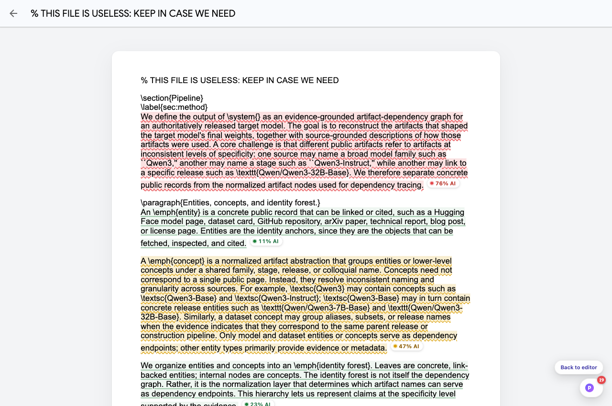

# Pangram AI Detector

**See what's AI-written, right on the page.** Pangram is a Chrome extension that
labels the text you read with a small per-paragraph confidence chip — think
Immersive Translate, but instead of translating, it answers *"did a human write
this?"* — inline, live, on every site.

> **Scoring status:** the detection backend is currently a development stub that
> produces deterministic pseudo-random scores (the same paragraph always gets the
> same number). The entire surface — capture, merging, rendering, caching — is
> final; the real detector plugs into one file (`lib/backend/getScoreClient.ts`)
> behind a stable contract (`lib/contract.ts`).

| Article pages | Dark mode + detail card |
| --- | --- |
|  |  |

| Paper / abstract pages | Google Docs reading view |
| --- | --- |
|  |  |

## What you get

- **A chip after every analyzed paragraph** — `38% AI` with a color-coded verdict
  (green = Human, amber = AI-Assisted, red = AI, gray = Insufficient). Chips scale
  with the surrounding text, sit on its baseline, and reflow with the page (RTL
  included). Hover — or tap, on touch — for the full calibrated readout: verdict,
  credible interval, p-value, words analyzed, always with an
  *"estimate, not proof"* caveat.
- **A colored underline across each analyzed unit** (toggleable), with a
  dark-tuned palette on dark pages.
- **A floating ball** (draggable, position remembered per site) with a live count
  of flagged paragraphs; click to show/hide everything instantly — no re-analysis,
  or press <kbd>Alt</kbd>+<kbd>Shift</kbd>+<kbd>P</kbd>. **Click the counter** to
  open the triage panel: every flagged paragraph in order — click one to jump
  there and pulse its chip, or **Copy report** for a markdown summary of all
  verdicts. The toolbar icon shows the per-tab flagged count too.
- **"Flagged only" mode**: every paragraph is still analyzed, but chips and
  underlines appear only on AI / AI-Assisted verdicts — calm pages by default if
  you prefer (popup → Show).
- **Analyze any selection**: select text → right-click →
  *Analyze selection with Pangram* — works even in editors, comment boxes and
  fragments passive capture skips; below the 50-word floor it says
  "too short to judge" instead of pretending.
- **Popup + options page**: per-site on/off rules, underline toggle, display
  mode, live scored count, per-site rule management; a first-run page explains
  the verdicts.
- **Google Docs support**: the editor is a canvas, so the ball offers
  **"Open reading view"** — a typographically cleaned static view of the same
  document where every paragraph is analyzed — and the way back to the exact tab
  you were editing.

## What it handles (the hard parts)

Text on the web is messy; the capture engine is built for it:

- **Visual paragraphs, not tags.** Layout is classified by computed style, so
  `<div>`-built sites (Zhihu, X-style apps), BR-separated prose, and
  pre-wrap chat transcripts segment the way they *look*. Inline markup —
  links, `code`, emphasis, drop caps, icons, images, formulas — never splits a
  sentence.
- **An evidence floor with merging.** Detection below ~50 words is unreliable, so
  short neighboring paragraphs (chat messages, list items, comment threads) are
  **analyzed together** as one unit instead of being skipped — while headings,
  navigation, link lists, ASCII art and column layouts act as barriers that are
  never merged across.
- **Living pages.** Infinite scroll, SPA navigations (pushState included), tab
  panels, accordions, `<details>`, edited and deleted text — badges appear,
  update, and disappear with the content. Scoring is viewport-first, so pages
  stay fast.
- **Everything, everywhere:** open shadow DOM and slots, same- and cross-origin
  iframes (webmail readers, embedded posts — ad slots are size-gated out),
  plain-text documents (`.txt`/`.log`/RFCs), pure-CJK and RTL text.
- **Zero page mutation** beyond inserting the chips themselves: no attributes, no
  inline styles on your DOM, underlines via the CSS Custom Highlight API, copied
  text never includes badge labels, badges inside links never navigate.

## Install (unpacked)

```bash
npm install
npm run build          # Chrome  → output/chrome-mv3/
npm run build:firefox  # Firefox → output/firefox-mv2/  (web-ext lint: 0 errors)
```

**Chrome:** `chrome://extensions` → Developer mode → **Load unpacked** →
`output/chrome-mv3`.

**Firefox (128+):** `about:debugging` → This Firefox → **Load Temporary
Add-on…** → `output/firefox-mv2/manifest.json`. (Underlines need Firefox 140+;
older versions degrade gracefully to chips-only. `npm run zip:firefox` builds
the AMO-submittable zip.)

Browse anywhere with prose. The ball sits bottom-right; the toolbar popup and
the options page hold the switches.

## Testing

Four suites, all runnable headed on a normal machine:

| Suite | Command | Checks | What it covers |
| --- | --- | --- | --- |
| Unit | `npm run test:unit` | 46 | walker/assembler logic in a real Chromium page (~5s) |
| E2E | `npm run test:e2e` | 22 | full extension on a 16-section fixture page |
| Scenarios | `npm run test:scenarios` | 26 | UI edge cases + 13 live sites (EN/AR/JA Wikipedia, HF, StackOverflow, RFC txt…) |
| Docs flow | `node test/docs-flow.mjs` | — | editor ⇄ reading-view round trip on a real public doc |
| Perf | `npm run test:perf` | 3 | 3000-paragraph budget: first badge <4s (measured ~0.4s), no long task >1s |

`npm run browser` opens a live Chromium with the extension for manual poking;
`node test/genicons.mjs` regenerates the icon set.

## Architecture (one paragraph)

A content script segments the page (`lib/dom/walker.ts`) into scoreable units,
claims their text nodes for incremental re-scans, and observes viewport,
mutations, attribute reveals and URL changes (`lib/capture/`). Units are batched
through a 3-lane priority scheduler to the MV3 service worker, which dedups,
caches (53-bit content hashes, model-versioned keys) and calls the active
`ScoreClient` — today `RandomStubScoreClient`, tomorrow a real detector, with
retry and never-cached degraded fallbacks (`lib/backend/`). Results render as
inline shadow-DOM chips and Highlight-API underlines (`lib/render/`). The
surface↔backend contract lives in `lib/contract.ts`; swapping in a real model
touches exactly one factory function.

## Privacy

Nothing leaves the browser. Text goes from the page to the extension's own
service worker and back; the stub scores locally. The batch envelope carries only
a hostname + language hint by design — if a remote backend is ever added, that
contract keeps full URLs and page identity out of every request.
